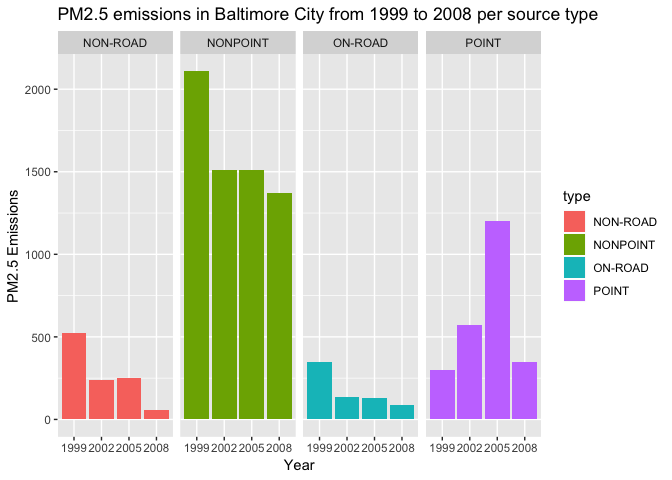
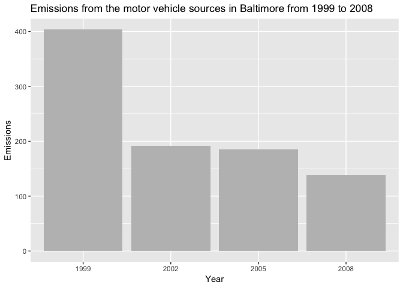

Fine particulate matter (PM2.5) is an ambient air pollutant for which there is strong evidence that it is harmful to human health. In the United States, the Environmental Protection Agency (EPA) is tasked with setting national ambient air quality standards for fine PM and for tracking the emissions of this pollutant into the atmosphere. Approximatly every 3 years, the EPA releases its database on emissions of PM2.5. This database is known as the National Emissions Inventory (NEI). More information about the NEI at the EPA can be found on the National Emissions Inventory web site.

For each year and for each type of PM source, the NEI records how many tons of PM2.5 were emitted from that source over the course of the entire year. Data used for this study are for 1999, 2002, 2005, and 2008.

**Data**

The data are available as a single zip file which contains two files:

(i) **PM2.5 Emissions Data** (summarySCC_PM25.rds);

(ii) **Source Classification Code Table** (Source_Classification_Code.rds).

*PM2.5 Emissions Data* contains a data frame with all of the PM2.5 emissions data for 1999, 2002, 2005, and 2008. For each year, the table contains number of tons of PM2.5 emitted from a specific type of source for the entire year, with the following variables:

- *fips*: A five-digit number (represented as a string) indicating the U.S. county;

- *SCC*: The name of the source as indicated by a digit string (see source code classification table);

- *Pollutant*: A string indicating the pollutant;

- *Emissions*: Amount of PM2.5 emitted, in tons;

- *type*: The type of source (point, non-point, on-road, or non-road);

- *year*: The year of emissions recorded.

*Source Classification Code Table* provides a mapping from the SCC digit strings in the Emissions table to the actual name of the PM2.5 source. The sources are categorized in a few different ways from more general to more specific and you may choose to explore whatever categories you think are most useful. For example, source “10100101” is known as “Ext Comb /Electric Gen /Anthracite Coal /Pulverized Coal”.

The overall goal is to explore the National Emissions Inventory database and see what it say about fine particulate matter pollution in the United states over the 10-year period 1999–2008.

### Questions:

1. Have total emissions from PM2.5 decreased in the United States from 1999 to 2008? Using the base plotting system, make a plot showing the total PM2.5 emission from all sources for each of the years 1999, 2002, 2005, and 2008.

2. Have total emissions from PM2.5 decreased in the Baltimore City, Maryland (\color{red}{\verb|fips == "24510"|}fips=="24510") from 1999 to 2008? Use the base plotting system to make a plot answering this question.

3. Of the four types of sources indicated by the \color{red}{\verb|type|}type (point, nonpoint, onroad, nonroad) variable, which of these four sources have seen decreases in emissions from 1999–2008 for Baltimore City? Which have seen increases in emissions from 1999–2008? Use the ggplot2 plotting system to make a plot answer this question.

4. Across the United States, how have emissions from coal combustion-related sources changed from 1999–2008?

5. How have emissions from motor vehicle sources changed from 1999–2008 in Baltimore City?

6. Compare emissions from motor vehicle sources in Baltimore City with emissions from motor vehicle sources in Los Angeles County, California (fips=="06037"). Which city has seen greater changes over time in motor vehicle emissions?

### Loading and preprocessing the data

First, clear R environment and load necessary libraries.

```r
rm(list=ls())
library(datasets); library(ggplot2); library(dplyr) 
```

Unzip and read data.

```r
if (!file.exists("./summarySCC_PM25.rds")) {
        unzip(zipfile = "./exdata_data_NEI_data.zip", exdir = "./NEIdata")}

NEI <- readRDS("NEIdata/summarySCC_PM25.rds")
SCC <- readRDS("NEIdata/Source_Classification_Code.rds")
```

### 1. Have total emissions from PM2.5 decreased in the United States from 1999 to 2008? 

```r
TotalEmissions <- aggregate(Emissions ~ year, NEI, sum)
```

Using the base plotting system, make a plot showing the total PM2.5 emission from all sources for each of the years 1999, 2002, 2005, and 2008.

```r
Emissions <- TotalEmissions$Emissions
Year <- TotalEmissions$year
with(TotalEmissions,
barplot(Emissions, Year, names.arg = Year, 
        xlab="Year", ylab="PM2.5 Emissions",
        main = "Total PM2.5 emissions in the United States from 1999 to 2008", col = "blue"))
```

<!-- -->

Plot shows that total PM2.5 emission from all sources decreased in the United States from 1999 to 2008.

### 2. Have total emissions from PM2.5 decreased in the  Baltimore City, Maryland (fips==24510) from 1999 to 2008? 

```r
Baltimore <- NEI[NEI$fips == "24510", ]
TotalEmissionsBaltimore <- aggregate(Emissions ~ year, Baltimore, sum)
```

Use the base plotting system to make a plot answering this question.

```r
Emissions <- TotalEmissionsBaltimore$Emissions
Year <- TotalEmissionsBaltimore$year
with(TotalEmissionsBaltimore,
     barplot(Emissions, Year, names.arg = Year, 
             xlab = "Year", ylab = "PM2.5 Emissions",
             main = "Total PM2.5 emissions in Baltimore City from 1999 to 2008", col = "green"))
```

<!-- -->

Plot shows that overall total PM2.5 emission from all sources decreased in Baltimore City, Maryland from 1999 to 2008.

### 3. Of the four types of sources indicated by the *type* (point, nonpoint, onroad, nonroad) variable, which of these four sources have seen decreases in emissions from 1999–2008 for Baltimore City? Which have seen increases in emissions from 1999–2008? 

```r
Baltimore <- NEI[NEI$fips == "24510", ]
EmissionsTypeBaltimore <- aggregate(Emissions ~ year + type, Baltimore, sum)
```

Use the ggplot2 plotting system to make a plot answer this question.

```r
Emissions <- EmissionsTypeBaltimore$Emissions

plot3 <- ggplot(EmissionsTypeBaltimore, aes(factor(year), Emissions, fill = type)) + 
        geom_bar(stat = "identity") +
        facet_grid(.~type, scales = "free", space="free") +
        labs(title = "PM2.5 emissions in Baltimore City from 1999 to 2008 per source type",
             x = "Year", y = "PM2.5 Emissions")
plot3
```

<!-- -->

Plot shows that PM2.5 emissions in Baltimore City from 1999 to 2008 decreased 
for *non-road*, *on-road* and *nonpoint* type of sources. Increase in emission can be seen for
the *point* source with a pick achieved in 2005. Emission in 2008 decreased compared with 2005, 
but it is still higher than emission from 1999.

### 4. Across the United States, how have emissions from coal combustion-related sources changed from 1999–2008?
According to https://www.epa.gov/, "coal" data information can be found in the SCC.Level.Three (e.g., Anthracite Coal) and in the SCC.Level.Four (e.g., Pulverized Coal). Combustion data are found in the SCC.Level.One. Hence, we will filter SCC data by "Coal" in Levels 3 and 4, and by "Combustion" in Level 1.

```r
SCC_Coal_Combustion <- SCC %>%
        filter(grepl('[Cc]ombustion', SCC.Level.One)) %>%
        filter(grepl("[Cc]oal", SCC.Level.Three)) %>%
        filter(grepl("[Cc]oal", SCC.Level.Four)) %>%
        select(SCC, SCC.Level.One, SCC.Level.Three, SCC.Level.Four)

NEI_Coal_Combustion <- inner_join(NEI, SCC_Coal_Combustion, by = "SCC")
```

```
## Warning: Column `SCC` joining character vector and factor, coercing into
## character vector
```

Use the ggplot2 plotting system to make a plot answer this question.

```r
Emissions <- NEI_Coal_Combustion$Emissions

plot4 <- ggplot(NEI_Coal_Combustion, aes(factor(year), Emissions)) + 
         geom_bar(stat = "identity", fill = "red") + 
         labs(title = "Emissions from coal combustion-related sources in the United 
              States from 1999 to 2008", x = "Year", y = "Emissions")
plot4
```

<!-- -->

Plot shows that emissions from coal combustion-related sources in the United States 
decreased overall from 1999 to 2008.

### 5. How have emissions from motor vehicle sources changed from 1999–2008 in Baltimore City?
We will filter CC data by "Vehicles" in the SCC.Level.Two.

```r
SCC_Vehicles <- SCC %>%
        filter(grepl('[Vv]ehicle', SCC.Level.Two)) %>%
        select(SCC, SCC.Level.Two)

BaltimoreVehicles <- NEI %>%
        filter(fips == "24510") %>%
        select(SCC, fips, Emissions, year) %>%
        inner_join(SCC_Vehicles, by = "SCC") %>%
        group_by(year) %>%
        summarise(Emissions = sum(Emissions, na.rm = TRUE)) %>%
        select(Emissions, year)
```

```
## Warning: Column `SCC` joining character vector and factor, coercing into
## character vector
```

Use the ggplot2 plotting system to make a plot answer this question.

```r
Emissions <- BaltimoreVehicles$Emissions

plot5 <- ggplot(BaltimoreVehicles, aes(factor(year), Emissions)) + 
        geom_bar(stat = "identity", fill = "grey") + 
        labs(title = "Emissions from the motor vehicle sources in Baltimore from 1999 to 2008",
             x = "Year", y = "Emissions")
plot5
```

<!-- -->

Plot shows that emissions from motor vehicle sources in Baltimore decreased from 1999 to 2008.

### 6. Compare emissions from motor vehicle sources in Baltimore City with emissions from motor vehicle sources in Los Angeles County, California (fips==06037). Which city has seen greater changes over time in motor vehicle emissions?

```r
SCC_Vehicles <- SCC %>%
        filter(grepl('[Vv]ehicle', SCC.Level.Two)) %>%
        select(SCC, SCC.Level.Two)

BaltimoreVehicles <- NEI %>%
        filter(fips == "24510") %>%
        select(SCC, fips, Emissions, year) %>%
        inner_join(SCC_Vehicles, by = "SCC") %>%
        group_by(year) %>%
        summarise(Emissions = sum(Emissions, na.rm = TRUE)) %>%
        select(Emissions, year)
```

```
## Warning: Column `SCC` joining character vector and factor, coercing into
## character vector
```

```r
LosAngelesVehicles <- NEI %>%
        filter(fips == "06037") %>%
        select(SCC, fips, Emissions, year) %>%
        inner_join(SCC_Vehicles, by = "SCC") %>%
        group_by(year) %>%
        summarise(Emissions = sum(Emissions, na.rm = TRUE)) %>%
        select(Emissions, year)
```

```
## Warning: Column `SCC` joining character vector and factor, coercing into
## character vector
```

```r
BaltimoreVehicles$city <- "Baltimore City"
LosAngelesVehicles$city <- "Los Angeles County"

Comparison <- rbind(BaltimoreVehicles, LosAngelesVehicles)
```

Use the ggplot2 plotting system to make a plot answer this question.

```r
plot6 <- ggplot(Comparison, aes(factor(year), Emissions, fill = city)) + 
        geom_bar(stat = "identity") + 
        facet_grid(.~city, scales = "free", space="free") + 
        labs(title = "Emissions from the motor vehicle sources in Baltimore compared with Los Angeles 
             from 1999 to 2008", x = "Year", y = "Emissions")
plot6
```

<!-- -->

Plot shows that Las Angeles County has huge PM2.5 emissions compared with Baltimore city. 
Moreover, if in Baltimore emissions decreased from 1999 to 2008, in Los Angeles County can be
seen increasing of emissions from the motor vehicle sources, with a pick in 2005. Even thought 
emissions decreased in 2008 compared with 2005 in LA, they are still bigger that emissions from 1999.
